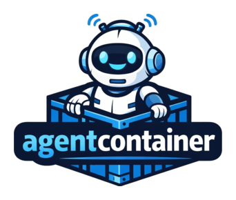

<div align="center">



[](https://github.com/jpmelos/agentcontainer/actions/workflows/ci.yaml)

</div>

A standard way to declare and run agent containers for your projects. Clone a
repo, run one command, and talk to a fully configured AI agent:

- **Zero setup**: `agentcontainer run` builds and launches a container with
  every tool your agent needs, as declared by the project maintainer.
- **Composable**: Your local configuration merges with the project's, so you
  keep your own agent harness and credentials while inheriting project-specific
  tooling.
- **Reproducible**: The container is the environment. Every contributor gets
  the same agent setup, every time.

## Quick start

```bash
cargo install --locked agentcontainer
git clone git@github.com:your-org/your-project
cd your-project
agentcontainer run
# Talk to the LLM.
```

## Installation

```
cargo install --locked agentcontainer
```

## Configuration

`agentcontainer` reads configuration from the following sources, listed from
lowest to highest priority:

| Source                | Path                                                                                                                                                                              |
| --------------------- | --------------------------------------------------------------------------------------------------------------------------------------------------------------------------------- |
| XDG global config     | `~/.config/agentcontainer/config.toml`                                                                                                                                            |
| Home config           | `~/.agentcontainer/config.toml`                                                                                                                                                   |
| Ancestor configs      | `{ancestor}/.agentcontainer/config.toml` for each ancestor directory from `/` towards the current working directory (excluding the CWD itself). Closer to `/` has lower priority. |
| Project config        | `.agentcontainer/config.toml`                                                                                                                                                     |
| Local project config  | `.agentcontainer/config.local.toml`                                                                                                                                               |
| Environment variables | `AGENTCONTAINER_<KEY>`                                                                                                                                                            |
| CLI arguments         | `--<key>` flags                                                                                                                                                                   |

### Configuration keys

| Key                     | Default                                            | Description                                                                                                       |
| ----------------------- | -------------------------------------------------- | ----------------------------------------------------------------------------------------------------------------- |
| `dockerfile`            | `.agentcontainer/Dockerfile`                       | Path to the Dockerfile.                                                                                           |
| `build_context`         | `.`                                                | Directory used as the Docker build context.                                                                       |
| `build_arguments`       | _(empty)_                                          | Extra `--build-arg` flags for `docker build`. See [Build arguments](#build-arguments).                            |
| `pre_build`             | _(empty)_                                          | Paths to executables to run before `docker build`. See [Pre-build hooks](#pre-build-hooks).                       |
| `project_name`          | Last component of the current directory, slugified | Name used in the Docker image tag.                                                                                |
| `username`              | Current OS user (from `whoami`)                    | Username embedded in the image tag.                                                                               |
| `target`                | _(none)_                                           | Docker build `--target`. When set, appended to the image tag.                                                     |
| `allow_stale`           | `false`                                            | Use an existing image if the build fails, instead of returning an error.                                          |
| `force_rebuild`         | `false`                                            | Rebuild unconditionally, bypassing the staleness check.                                                           |
| `no_build_cache`        | `false`                                            | Pass `--no-cache` to `docker build`.                                                                              |
| `no_rebuild`            | `false`                                            | Skip the build entirely. Errors if no image exists yet.                                                           |
| `volumes`               | _(empty)_                                          | Host-to-container volume mounts. See [Volumes](#volumes).                                                         |
| `environment_variables` | _(empty)_                                          | Environment variables for the container. See [Container environment variables](#container-environment-variables). |
| `pre_run`               | _(empty)_                                          | Paths to executables to run before `docker run`. See [Pre-run hooks](#pre-run-hooks).                             |

`force_rebuild` and `no_rebuild` are mutually exclusive.

`target` can be unset by a higher-priority source by setting it to `"!"`. This
suppresses a value inherited from a lower-priority source. For example, if a
global config sets `target = "builder"`, a project config can override it with
`target = "!"` to build without a target. The same works via environment
variables (`AGENTCONTAINER_TARGET="!"`) and CLI (`--target "!"`).

`dockerfile`, `build_context`, and `target` must not be set to an empty string.
Setting any of them to `""` is a validation error. `pre_build` and `pre_run`
entries must not be empty strings.

### Path resolution for `dockerfile` and `build_context`

A leading `~` in `dockerfile` or `build_context` is expanded to the user's home
directory. Only `~` alone or `~/…` is expanded; `~user/…` and embedded tildes
are left untouched. Relative paths are resolved against the current working
directory. All paths are lexically normalized: `.` and `..` components are
resolved and consecutive slashes are collapsed, without accessing the
filesystem.

### Image naming

The Docker image tag is derived from the resolved configuration:

```
agentcontainer_<username>_<project_name>:latest
agentcontainer_<username>_<project_name>_<target>:latest  # when target is set
```

`username`, `project_name`, and `target` are all slugified before being
embedded in the tag: lowercased, non-alphanumeric characters replaced with `_`,
consecutive underscores collapsed, and leading/trailing underscores trimmed.

`username` and `project_name` must contain at least one alphanumeric character.
If the slug of either value would be empty, `get_config` returns an error.

### Build arguments

The `build_arguments` table defines extra `--build-arg` flags passed to
`docker build`. Values can be:

- A string: pass this literal value as a build argument.
- `true`: inherit the value from the host environment variable with the same
  name.
- `false`: remove a build argument inherited from a lower-priority config
  source.

```toml
[build_arguments]
USERNAME = "alice"
BUILD_DATE = "2026-03-06"
HOME = true               # inherit from host environment
OLD_ARG = false           # suppress from a lower-priority source
```

On the CLI, use `--build-arg` (repeatable):

```sh
# Set a literal value.
agentcontainer build --build-arg USERNAME=alice

# Inherit from the host environment.
agentcontainer build --build-arg HOME

# Remove a build argument inherited from config files.
agentcontainer build --build-arg '!OLD_ARG'
```

Build argument keys must be valid POSIX identifiers: start with a letter or
underscore, followed by ASCII letters, digits, or underscores.

### Pre-build hooks

The `pre_build` option specifies a list of paths to executables that run before
`docker build`. Hooks form a pipeline: the first hook receives the hookable
arguments computed from the configuration (i.e. `--build-arg` entries), and
each subsequent hook receives the output of the previous one. The final result
is injected into the `docker build` command after all built-in flags but before
the build context. Built-in flags managed by agentcontainer (`--file`,
`--target`, `--tag`, `--no-cache`, build context) are not exposed to hooks.

Lists from multiple config sources are concatenated (lower-priority first). For
example, a hook defined in `config.toml` runs before one added via
`config.local.toml` or the CLI.

This provides a way to dynamically compute Docker build flags based on the host
environment.

**Note:** Pre-build hooks run unconditionally whenever a `build` or `run`
command is invoked, even if the build is ultimately skipped (e.g. because the
image is already up to date or `--no-rebuild` is set). Keep this in mind if a
hook is expensive or has side effects.

Each hook:

- Receives the path to a temporary file as its first argument (`$1`). The file
  contains the current arguments as a TOML document with an `args` key (e.g.
  `args = ["--build-arg", "FOO=bar"]`).
- Must print a TOML document with the same shape to stdout (e.g.
  `args = ["--build-arg", "FOO=bar", "--label", "version=1"]`).
- Must exit with status 0.
- Must produce valid UTF-8 output.

Example hook script (requires `toml` from `toml-cli` and `jq`):

```sh
#!/bin/sh
set -euo pipefail

input_file="$1"

# Read the current args from the input file.
existing=$(toml get "$input_file" args)

# Build extra entries.
extra=$(jq -n \
	--arg a1 "--build-arg" --arg v1 "BUILD_DATE=$(date "+%Y-%m-%d")" \
	'[$a1, $v1]')

# Merge and output.
merged=$(jq -cn --argjson existing "$existing" --argjson extra "$extra" \
	'$existing + $extra')
echo "args = ${merged}"
```

A leading `~` in each path is expanded to the user's home directory. Only `~`
alone or `~/…` is expanded; `~user/…` and embedded tildes are left untouched.
Relative paths are resolved against the current working directory. All paths
are lexically normalized: `.` and `..` components are resolved and consecutive
slashes are collapsed, without accessing the filesystem.

In TOML configuration:

```toml
pre_build = ["~/hooks/pre-build.sh"]
pre_build = [
  "scripts/pre-build.sh",
] # resolved relative to the current working directory
pre_build = ["hooks/a.sh", "hooks/b.sh"] # multiple hooks in one source
```

On the CLI (repeatable):

```sh
agentcontainer build --pre-build ~/hooks/pre-build.sh
agentcontainer build --pre-build hooks/a.sh --pre-build hooks/b.sh
```

### Volumes

The `volumes` table maps container paths to host paths. In TOML, each key is a
container path and the value is either:

- A string: an explicit host path to mount at the container path.
- `true`: mount at the same path in the container as on the host (the key is
  used as both host and container path).
- `false`: remove a volume inherited from a lower-priority config source.

A leading `~` in container-path keys and host-path values is expanded to the
user's home directory before config sources are merged. This means `~/.ssh` and
`/home/alice/.ssh` from different sources are treated as the same volume during
priority resolution. Only `~` alone or `~/…` is expanded; `~user/…` and
embedded tildes are left untouched.

Relative host paths that look like filesystem paths (start with `.` or contain
`/`) are resolved against the current working directory. Plain names without a
`.` prefix or `/` (e.g. `my_volume`) are treated as Docker volume names and
left unchanged. All resolved paths are lexically normalized: `.` and `..`
components are resolved and consecutive slashes are collapsed, without
accessing the filesystem.

```toml
[volumes]
"/workspace" = "~/projects/myproject"
"/data" = "/mnt/shared-data"
"/app" = "./src"                      # resolved relative to the current working directory
"~/.ssh" = true                       # mount at the same path inside the container
"/cache" = "my_cache_volume"          # Docker volume name, left unchanged
"/unwanted" = false                   # suppress a volume defined in a lower-priority source
```

On the CLI, use `--volume` (or `-v`) (repeatable):

```sh
# Mount a host path into the container.
agentcontainer build --volume '~/projects/myproject:/workspace'

# Mount at the same path inside the container (same-path shorthand).
agentcontainer build -v /home/alice/.ssh

# Remove a volume inherited from config files.
agentcontainer build --volume '!/unwanted'
```

### Container environment variables

The `environment_variables` table defines environment variables to pass into
the container. Values can be:

- A string: pass this literal value.
- `true`: inherit the variable from the host environment.
- `false`: remove a variable inherited from a lower-priority config source.

```toml
[environment_variables]
EDITOR = "nvim"
SSH_AUTH_SOCK = true # inherit from host
OLD_VAR = false      # suppress from a lower-priority source
```

On the CLI, use `--env` (or `-e`) (repeatable):

```sh
# Set a literal value.
agentcontainer build --env EDITOR=nvim

# Inherit from the host.
agentcontainer build --env SSH_AUTH_SOCK

# Remove a variable inherited from config files.
agentcontainer build -e '!OLD_VAR'
```

Variable keys must be valid POSIX identifiers: start with a letter or
underscore, followed by ASCII letters, digits, or underscores.

### Pre-run hooks

The `pre_run` option specifies a list of paths to executables that run before
`docker run`. Hooks form a pipeline: the first hook receives the hookable
arguments computed from the configuration (i.e. `--volume` and `--env`
entries), and each subsequent hook receives the output of the previous one. The
final result is injected into the `docker run` command after all built-in flags
but before the image name. Built-in flags managed by agentcontainer (`--init`,
`--rm`, `--tty`, `--interactive`, `--user`, `--group-add`, `--name`,
`--workdir`, the current-directory volume, the worktree volume, the image name,
and container arguments) are not exposed to hooks.

Lists from multiple config sources are concatenated (lower-priority first). For
example, a hook defined in `config.toml` runs before one added via
`config.local.toml` or the CLI.

This provides a way to dynamically compute Docker flags at runtime based on the
host environment.

Each hook:

- Receives the path to a temporary file as its first argument (`$1`). The file
  contains the current arguments as a TOML document with an `args` key (e.g.
  `args = ["--volume", "/host:/container"]`).
- Must print a TOML document with the same shape to stdout (e.g.
  `args = ["--volume", "/host:/container", "--network", "host"]`).
- Must exit with status 0.
- Must produce valid UTF-8 output.

Example hook script (requires `toml` from `toml-cli` and `jq`):

```sh
#!/bin/sh
set -euo pipefail

input_file="$1"

# Read the current args from the input file.
existing=$(toml get "$input_file" args)

# Build extra entries.
extra=$(jq -n \
	--arg a1 "--network" --arg v1 "host" \
	'[$a1, $v1]')

# Merge and output.
merged=$(jq -cn --argjson existing "$existing" --argjson extra "$extra" \
	'$existing + $extra')
echo "args = ${merged}"
```

A leading `~` in each path is expanded to the user's home directory, just like
for volume paths and `pre_build`. Only `~` alone or `~/…` is expanded;
`~user/…` and embedded tildes are left untouched. Relative paths are resolved
against the current working directory. All paths are lexically normalized: `.`
and `..` components are resolved and consecutive slashes are collapsed, without
accessing the filesystem.

In TOML configuration:

```toml
pre_run = ["~/hooks/pre-run.sh"]
pre_run = [
  "scripts/pre-run.sh",
] # resolved relative to the current working directory
pre_run = ["hooks/a.sh", "hooks/b.sh"] # multiple hooks in one source
```

On the CLI (repeatable):

```sh
agentcontainer run --pre-run ~/hooks/pre-run.sh
agentcontainer run --pre-run hooks/a.sh --pre-run hooks/b.sh
```

### Container naming

When running a container, the name is derived from the project name and a
random numeric suffix:

```
agentcontainer_<project_name>_<suffix>
```

The slugified project name is truncated to 41 characters (with any trailing
underscore removed after truncation) so that the full container name never
exceeds Docker's 63-character limit for container names.

### Example configuration file

```toml
dockerfile = ".agentcontainer/Dockerfile"
build_context = "."
project_name = "myproject"
username = "alice"

[volumes]
"/workspace" = "~/projects/myproject"
"~/.ssh" = true                       # same path on host and in container

[environment_variables]
EDITOR = "nvim"
SSH_AUTH_SOCK = true
```

### Environment variables

Each configuration key maps to an `AGENTCONTAINER_<KEY>` environment variable,
where `<KEY>` is the uppercase version of the key name. Values are parsed as
TOML. For example:

```sh
AGENTCONTAINER_DOCKERFILE=".agentcontainer/Dockerfile"
AGENTCONTAINER_BUILD_CONTEXT="."
AGENTCONTAINER_BUILD_ARGUMENTS='{BUILD_DATE = "2026-03-06", HOME = true}'
AGENTCONTAINER_PRE_BUILD='["~/hooks/pre-build.sh"]'
AGENTCONTAINER_ALLOW_STALE=true # or `false`
AGENTCONTAINER_VOLUMES='{"/workspace" = "~/projects/myproject", "~/.ssh" = true}'
AGENTCONTAINER_ENVIRONMENT_VARIABLES='{EDITOR = "nvim", SSH_AUTH_SOCK = true}'
AGENTCONTAINER_PRE_RUN='["~/hooks/pre-run.sh"]'
```

## Commands

### `config`

Print the resolved configuration, with all sources merged, as TOML.

```
agentcontainer config
```

### `build`

Build the agent container Docker image.

```
agentcontainer build
```

The build is skipped if the image is already up to date. A rebuild is triggered
when any of the following is true:

- No image exists yet.
- The Dockerfile was modified after the image was last tagged.
- The image was last tagged before the start of today (local time).
- `force_rebuild` is set.

### `run`

Run the agent container. The image is automatically built (or rebuilt if stale)
before starting the container. This replaces the current process with
`docker run` via `exec`.

```
agentcontainer run [-- <container-args>...]
```

Arguments after `--` are passed through to the container's entrypoint.
Everything before `--` is parsed by `agentcontainer` itself and will error on
unrecognized flags.

```sh
# Run interactively with no extra arguments.
agentcontainer run

# Pass arguments to the container entrypoint.
agentcontainer run -- --print --output-format json

# Global flags still go before the subcommand.
agentcontainer --project-name foo run -- --help
```

The build step honors all build-related configuration keys (`allow_stale`,
`force_rebuild`, `no_build_cache`, `no_rebuild`, etc.). If the image is already
up to date, the build is skipped and the container starts immediately.

The container is started with:

- **`--init`**: the container uses an init process.
- **`--rm`**: the container is automatically removed on exit.
- **UID/GID mapping**: the container runs as the current user and group, with
  group `0` added via `--group-add`.
- **Current directory volume**: the working directory is mounted into the
  container at the same path and set as the container's working directory.
- **Git worktree volume**: if the current directory is a linked Git worktree,
  the main worktree root is also mounted so that Git objects are accessible.
- **Configured volumes and environment variables**: as defined in the
  configuration.
- **TTY mode**: `--tty` (allocate pseudo-TTY) and `--interactive` (keep stdin
  open) are only added when standard input is a TTY. This means piped or
  scripted invocations won't cause Docker to hang or emit spurious warnings.

## Example

This project is the example.

First, we have [`.agentcontainer/Dockerfile`](.agentcontainer/Dockerfile). It
installs all the tools the agent will need to interact with this project during
development. For example:

- `docker`, so the agent can interact with the development container.
- `git` and `gh` to interact with Git history and GitHub PRs.
- Prepares the container with the current user's ID and group ID to avoid
  permission problems.
- Mechanisms to bust image caching to easily update the agent harness
  periodically.
- Install an agent harness (Claude Code).

And the [`.agentcontainer/config.toml`](.agentcontainer/config.toml) file
configures scripts that allow customization of Docker build arguments and
Docker run arguments.

- The [`pre_build`](.agentcontainer/get_build_args.sh) hook takes care of
  passing the current user's ID and group ID to the image, and today's date to
  bust the cache daily to update the agent harness.
- The [`pre_run`](.agentcontainer/get_run_args.sh) hook takes care of exposing
  the right Docker socket for Docker-in-Docker functionality.

`agentcontainer` always mounts the project into the container, and it
automatically detects if it is in a Git worktree and, if so, makes sure to also
mount the main worktree to make sure Git commands will be available to the
agent.

The [`CLAUDE.md`](CLAUDE.md) tells the agent about the development tools it has
available (one to run the linters, and one to run the tests), and those tools
take care of everything for the agent (building the development container and
running it if needed).

The objective is that all you have to do is download the project, run
`agentcontainer run`, and start talking to the LLM. Describe the change you
want to make, and off it goes all the way to making a commit. If you leverage
the flexible configuration from above by sharing a `GH_TOKEN`, it could even
push the PR for you.

The `pre_build` and `pre_run` scripts could do anything you need. For example:

- Dynamically customize your `~/.claude/settings.json` file depending on each
  project's needs, push the settings to a temporary file, and mount that
  temporary file into the agent container.
- Fetch your LLM provider API key from your secret manager (1Password,
  LastPass, BitWarden, `age`) and inject it into the agent container via
  `--env` or `--env-file`.
- Fetch your GitHub token and inject it into the agent container as `GH_TOKEN`.

## Roadmap

- **`in_build` hooks:** Executables to be injected into the build context and
  executed during the build process to allow customizing the image itself.
- **`post_run` hooks:** These hooks will receive the raw output of the AI
  harness, processes it, and outputs what should be printed to the user instead
  of the Ai harness output. Useful in print mode with raw JSON output, for
  example.

## Contributing

1. Fork this project.
2. Download it locally.
3. If you want assistance from Claude Code, run `agentcontainer run`.
4. Make your changes.
5. Push your changes to your forked repository.
6. Create a PR.

## License

This project is licensed under the [MIT license](LICENSE).

### Contributions

Unless you explicitly state otherwise, any contribution intentionally submitted
for inclusion in this repository by you shall be licensed as MIT, without any
additional terms or conditions.
